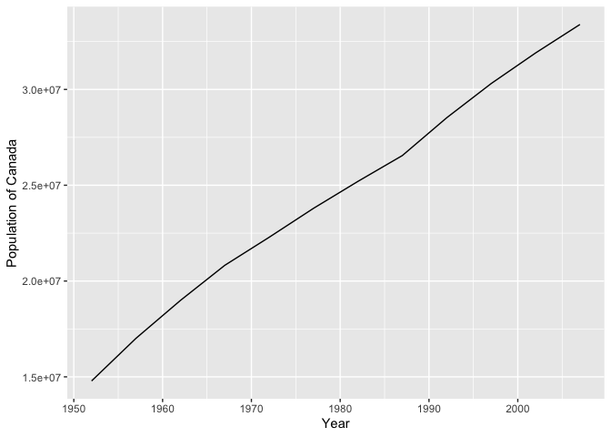
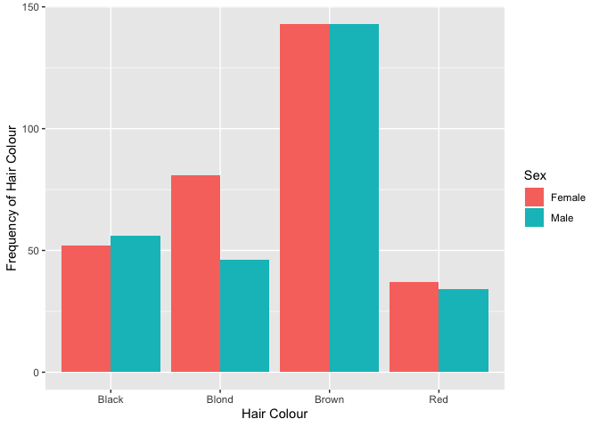

```r
library(ggplot2)
library(tidyverse)
library(datasets)
library(tibble)
library(gapminder)
```

Exercise 2 and 3

#Pick one quantitative variable out of dataset Gapminder - Population
##What is the range in Population? 


```r
  summarise(gapminder, minpop = min(pop), maxpop=max(pop))
```

```
## # A tibble: 1 x 2
##   minpop     maxpop
##    <int>      <int>
## 1  60011 1318683096
```

##What is the mean population? 


```r
  summarise(gapminder, meanpop = mean(pop))
```

```
## # A tibble: 1 x 1
##     meanpop
##       <dbl>
## 1 29601212.
```


##Graph of data spread - Population in Canada from 1952 - 2007


```r
gapminder %>% 
  filter(country == 'Canada') %>% 
  arrange(year) %>% 
  ggplot(aes(year,pop))+
  geom_line()+
  ylab("Population of Canada")+
  xlab("Year")
```

<!-- -->


#Pick one categorical variable out of dataset HairEyeColour - Eye Colour 
##What are the ranges in eye colour? 

```r
HairEyeColor %>% 
  as_tibble() %>% 
  distinct(Hair) 
```

```
## # A tibble: 4 x 1
##   Hair 
##   <chr>
## 1 Black
## 2 Brown
## 3 Red  
## 4 Blond
```


```r
HEC = HairEyeColor %>% 
  as_tibble()
```

##Plot the distribution of Hair Colour in a Plot to fulfill Exercise 3 requirement


```r
HEC %>% 
  ggplot(aes(Hair, weight = n, fill = Sex))+
  geom_bar(position = "dodge") +
  ylab("Frequency of Hair Colour") +
  xlab("Hair Colour")
```

<!-- -->

##Plot the distribution of life expectancy in African countries from 2000 - 2007 vs GDP


